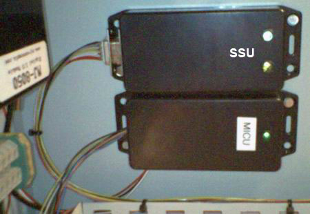

## Source code for project: [Sound alarm controller](https://link.stdout.no/Z)

Simple unit to control three sound signals; beep, siren and buzzer. Uses an AVR ATtiny2313 microcontroller.

Written in basic, using [Bascom-AVR](http://www.mcselec.com/).

### Author
[Thomas Jensen](https://thomas.stdout.no)
